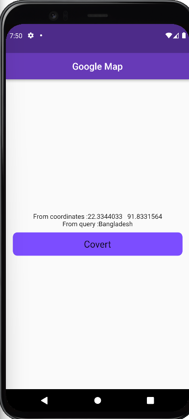
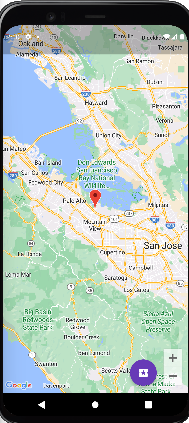
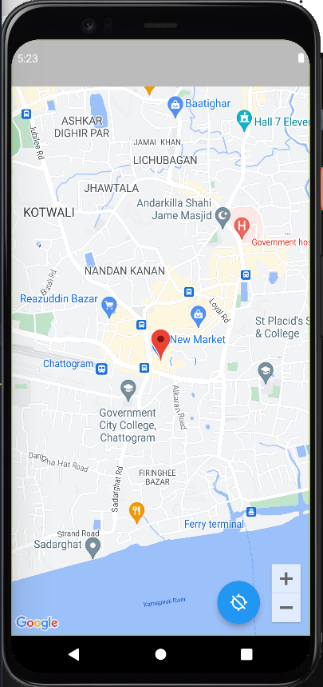

### Important Link :
- [google_maps_flutter: ^2.2.3](https://pub.dev/packages/google_maps_flutter)
- [geocoding: ^2.0.5](https://pub.dev/packages/geocoding)
- [flutter_geocoder: ^0.2.2-nullsafety](https://pub.dev/packages/flutter_geocoder)
- [geolocator: ^9.0.2](https://pub.dev/packages/geolocator)
- [uuid: ^3.0.7](https://pub.dev/packages/uuid)
- [http: ^0.13.5](https://pub.dev/packages/http)
- [custom_info_window: ^1.0.1](https://pub.dev/packages/custom_info_window/example)
- [Google Map Style](https://mapstyle.withgoogle.com/)
- [Icon](https://www.flaticon.com/search?word=car)
- [Google Cloud](https://console.cloud.google.com/apis/credentials?authuser=2&project=spheric-gecko-374305&supportedpurview=project&pli=1)

      
      
      
      
      
      
      
      
      

